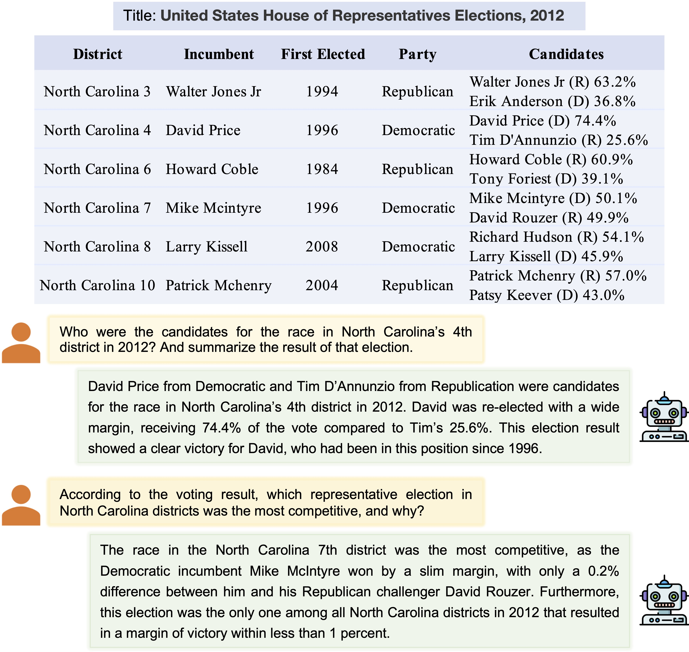

# QTSumm: Query-Focused Summarization over Tabular Data
The code and data for EMNLP 2023 paper [QTSumm: Query-Focused Summarization over Tabular Data](https://arxiv.org/abs/2305.14303).
<p align="center">

</p>

## Prepare Environment
We officially support python 3.8. You could use following commands to install the required packages
```
pip install -r requirements.txt
```

## QTSumm Dataset
We released the dataset at [https://huggingface.co/datasets/yale-nlp/QTSumm](https://huggingface.co/datasets/yale-nlp/QTSumm) using HuggingFace's features of _gated repositories_ to protect the data from automatic crawling.

## Finetuning Experiments
We have released following fintuned models in [Huggingface Hub](https://huggingface.co/yale-nlp).
- [yale-nlp/t5-large-finetuned-qtsumm](https://huggingface.co/yale-nlp/t5-large-finetuned-qtsumm)
- [yale-nlp/flan-t5-large-finetuned-qtsumm](https://huggingface.co/yale-nlp/flan-t5-large-finetuned-qtsumm)
- [yale-nlp/bart-large-finetuned-qtsumm](https://huggingface.co/yale-nlp/bart-large-finetuned-qtsumm)
- [yale-nlp/tapex-large-finetuned-qtsumm](https://huggingface.co/yale-nlp/tapex-large-finetuned-qtsumm)
- [yale-nlp/reastap-large-finetuned-qtsumm](https://huggingface.co/yale-nlp/reastap-large-finetuned-qtsumm)
- [yale-nlp/omnitab-large-finetuned-qtsumm](https://huggingface.co/yale-nlp/omnitab-large-finetuned-qtsumm)

We have prepared bash scripts for both finetuning and inference in the `finetuning/scripts` folder. Please ensure that you adjust and set `CUDA_VISIBLE_DEVICES` and batch size accordingly in `finetuning/yamls/*.yaml`. The current setting works for an 8x A6000-48G cluster with 1024G memory.

## LLM Zero-/Few-Shot Experiments
We have prepared bash scripts for LLM (i.e., open-source models in HuggingFace and OpenAI models) inference in the `llm_inference/scripts` folder. We used the framework of [vLLM](https://github.com/vllm-project/vllm) for open-source LLM inference. Please ensure that you adjust and set `CUDA_VISIBLE_DEVICES` accordingly the bash scripts. The current setting works for an 8x A6000-48G cluster with 1024G memory.

## Evaluation
We currently support following evaluation metrics:
- ROUGE
- BLEU
- METEOR
- BERTScore
- TAPAS-Acc
- AutoACU

Once all the inference results are ready in the folder `xxx`, you could use the following command to evaluate the results:
```
export PYTHONPATH=`pwd`; python evaluation/evaluate.py --prediction_dir xxx --dataset_name yale-nlp/QTSumm --split_name test
```

## Model Outputs
To facilitate the reproducibility of our results by other researchers, we have released the output files of both finetuned models and LLMs in `outputs` folder. 

## Contact
For any issues or questions, kindly email us at: Yilun Zhao (yilun.zhao@yale.edu).

## Citation
```
@misc{zhao2023qtsumm,
      title={QTSUMM: Query-Focused Summarization over Tabular Data}, 
      author={Yilun Zhao and Zhenting Qi and Linyong Nan and Boyu Mi and Yixin Liu and Weijin Zou and Simeng Han and Xiangru Tang and Yumo Xu and Arman Cohan and Dragomir Radev},
      year={2023},
      eprint={2305.14303},
      archivePrefix={arXiv},
      primaryClass={cs.CL}
}
```